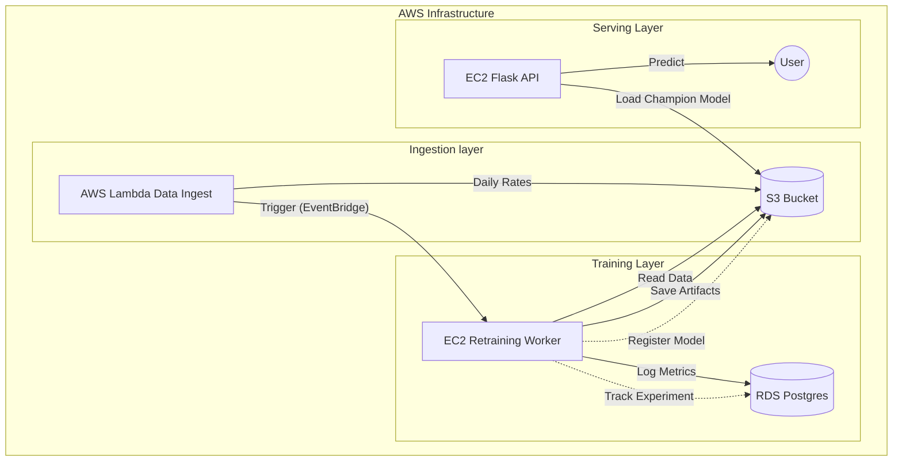

# 💶 EUR/USD Exchange Rate Prediction - MLOps Capstone

    

A production-grade machine learning pipeline to predict EUR/USD forex rates. This project demonstrates a complete **End-to-End MLOps** workflow, featuring automated daily retraining, cloud-native infrastructure, and a robust Continuous Deployment (CD) pipeline on AWS.

## 📋 High-Level Architecture

The system operates on a **Hybrid Cloud/Local** architecture designed for cost-efficiency and scalability. It uses a **Cloud-First, Local-Mirror** data strategy powered by the custom `DataManager`.



### Key Components (The 3 Containers)
1.  **Flask API Application**: Hosted on a persistent EC2 instance. It loads the "Champion" model from S3 and serves real-time predictions.
2.  **Data Ingestion Lambda**: A serverless function triggered Mon-Fri to fetch the latest EUR/USD data and update the S3 "Raw" data info.
3.  **Retraining Worker**: An EC2 instance that spins up automatically (triggered by EventBridge after ingestion), executes the retraining pipeline, updates the champion model if performance improves, and then shuts down to save costs.

### Key Features
- **🧬 Unified Data Layer**: The `DataManager` handles seamless synchronization between local development and S3.
- **🔄 Automated Daily Retraining**: Models (Linear Regression, ARIMA, LSTM) are retrained daily on the freshest data.
- **📊 Experiment Tracking**: Full MLflow integration. **RDS** stores parameters/metrics, while **S3** stores model artifacts.
- **🐳 Containerized Deployment**: All components (API, Retraining, Ingestion) are dockerized. The Retraining image is stored in **AWS ECR**.

## 🚀 Quick Start (Local)

1.  **Setup Environment**
    ```bash
    git clone <repo-url>
    cd eurusd-capstone
    python3.11 -m venv venv
    source venv/bin/activate
    pip install -r requirements.txt
    ```

2.  **Run Data Pipeline**
    The `DataManager` will check for missing data and sync from S3 if credentials are present.
    ```bash
    python src/01_ingest_data.py
    python src/02_preprocess.py
    ```

3.  **Train Models Locally**
    Changes to features or models are tracked by MLflow.
    ```bash
    python ml_pipeline.py
    ```

## ☁️ AWS Deployment Guide

**Prerequisite**: You need an active AWS account and `aws-cli` configured locally with Administrative permissions.

### 1. Infrastructure Setup
Use the scripts in `scripts/infra_setup` and `scripts/mlops_utils` to provision the base environment.

**A. Storage & MLflow**
Configures RDS (Tracking) and S3 (Artifacts).
```bash
sh scripts/mlops_utils/setup_mlflow_aws.sh
```

**B. ECR Repository**
Creates the registry for the retraining docker image.
```bash
sh scripts/infra_setup/setup_ecr_retrain.sh
```

### 2. Deploy Code Components

**A. Data Ingestion (Lambda)**
```bash
sh scripts/deployment/deploy_lambda_ingest.sh
```

**B. Retraining Worker (EC2)**
Builds the docker image, pushes to ECR, and configures the EC2 launch template.
```bash
sh scripts/deployment/deploy_retrain_ec2.sh
```

**C. Inference API (EC2)**
Deploys the Flask app to a persistent EC2 instance.
```bash
sh scripts/deployment/deploy_flask_api.sh
```

> 📖 **Full Re-Deployment Details**: Verify the **[AWS Deployment Guide](docs/deployment/6_AWS_DEPLOYMENT_GUIDE.md)** for step-by-step instructions.

## 📁 Repository Structure

```
eurusd-capstone/
├── api/                    # Serving API (Flask) source code
├── data/                   # Local data cache (Mirrors S3 structure)
├── docs/                   # 📚 Detailed Documentation
│   ├── architecture/       # System design & Data flows
│   ├── deployment/         # AWS & Docker deployment guides
│   ├── guides/             # Service Manuals
│   ├── debug/              # Debugging logs & notes
│   └── DOCUMENTATION_MAP.md # Index of all docs
├── notebooks/              # Jupyter Laboratories for EDA & Prototyping
├── scripts/                # Automation & DevOps Scripts
├── src/                    # Core ML Source Code
│   ├── 01_ingest_data.py   # Data fetching script
│   ├── 02_preprocess.py    # Feature engineering script
│   ├── 03_train_models.py  # Model training script
│   ├── 04_evaluate_select.py # Model evaluation & promotion
│   └── ml_pipeline.py      # Main pipeline orchestrator
├── utils/                  # Shared utilities (DataManager, Logger)
└── tests/                  # Unit & Integration tests
```

## 📞 Contact
*   **Maintainer**: [Your Name]
